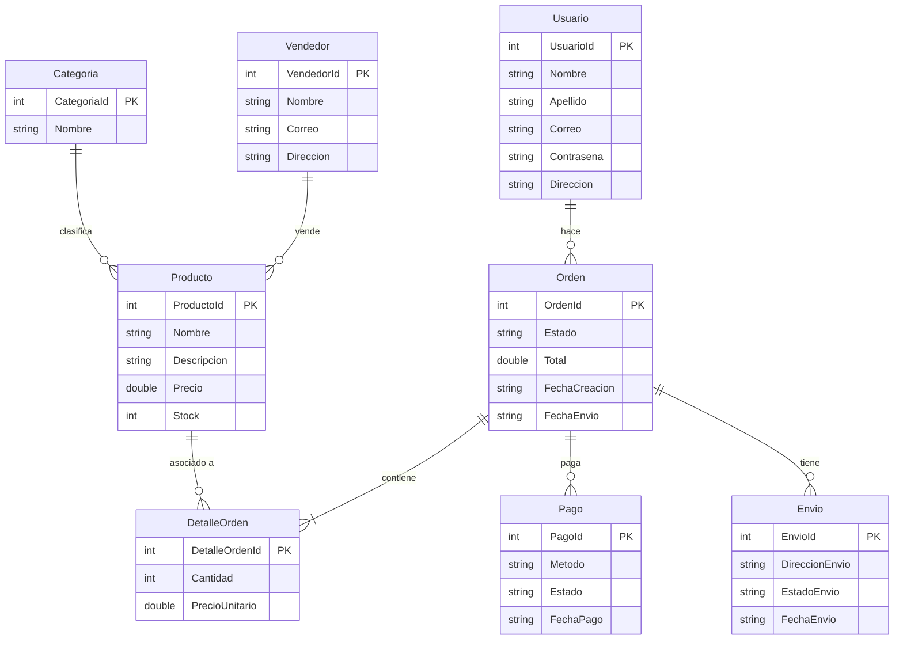

## Diagrama Beta de la Aplicacion

```mermaid

erDiagram
    Usuario {
        int UsuarioId PK
        string Nombre
        string Apellido
        string Correo
        string Contrasena
        string Direccion
    }

    Producto {
        int ProductoId PK
        string Nombre
        string Descripcion
        double Precio
        int Stock
    }

    Categoria {
        int CategoriaId PK
        string Nombre
    }

    Vendedor {
        int VendedorId PK
        string Nombre
        string Correo
        string Direccion
    }

    Orden {
        int OrdenId PK
        string Estado
        double Total
        string FechaCreacion
        string FechaEnvio
    }

    DetalleOrden {
        int DetalleOrdenId PK
        int Cantidad
        double PrecioUnitario
    }

    Pago {
        int PagoId PK
        string Metodo
        string Estado
        string FechaPago
    }

    Envio {
        int EnvioId PK
        string DireccionEnvio
        string EstadoEnvio
        string FechaEnvio
    }

    Usuario ||--o{ Orden : "hace"
    Orden ||--|{ DetalleOrden : "contiene"
    Producto ||--o{ DetalleOrden : "asociado a"
    Categoria ||--o{ Producto : "clasifica"
    Vendedor ||--o{ Producto : "vende"
    Orden ||--o{ Pago : "paga"
    Orden ||--o{ Envio : "tiene"

```

## Diagram de Clases

