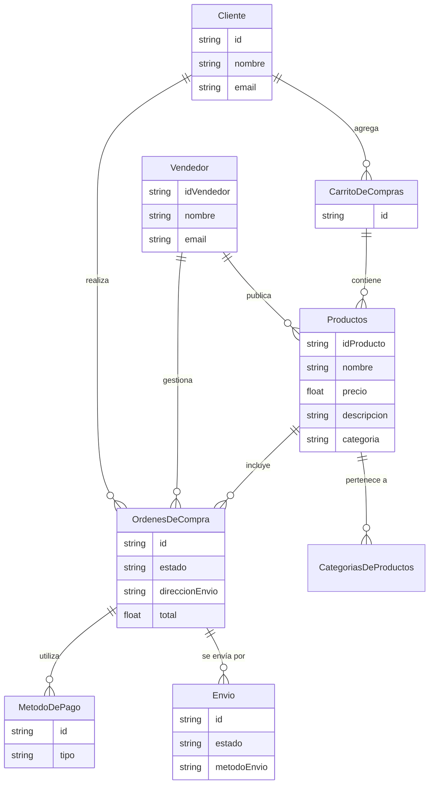

# Diagrama Beta de la Aplicacion 

```mermaid

erDiagram
    
Cliente {
string id
string nombre
string email }
    
Vendedor {
string idVendedor
string nombre
string email }
    
Productos {
string idProducto
string nombre
float precio
string descripcion
string categoria }

OrdenesDeCompra {
string id
string estado
string direccionEnvio
float total }

MetodoDePago {
string id
string tipo }

Envio {
string id
string estado
string metodoEnvio }


CarritoDeCompras {
string id }

Cliente ||--o{ CarritoDeCompras : "agrega"
Cliente ||--o{ OrdenesDeCompra : "realiza"
    
Vendedor ||--o{ Productos : "publica"
Vendedor ||--o{ OrdenesDeCompra : "gestiona"

Productos ||--o{ OrdenesDeCompra : "incluye"
OrdenesDeCompra ||--o{ MetodoDePago : "utiliza"
OrdenesDeCompra ||--o{ Envio : "se envía por"
CarritoDeCompras ||--o{ Productos : "contiene"
Productos ||--o{ CategoriasDeProductos : "pertenece a"
```